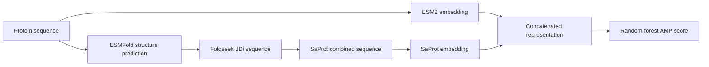

# SPEAR

**SPEAR** (**S**equence-structure **P**eptide **E**mbedding-guided **A**ntimicrobial **R**andom-forest predictor) is a structure-aware machine-learning framework for antimicrobial peptide (AMP) prediction.

SPEAR combines complementary representations of a peptide:

- **Sequence embedding:** ESM2 encodes the amino-acid sequence.
- **Structure embedding:** ESMFold predicts a structure when no experimental structure is available; Foldseek converts the structure into a 3Di sequence; SaProt embeds the paired amino-acid/3Di representation.
- **AMP prediction:** sequence and structure embeddings are concatenated and classified with a random forest. The default implementation also trains a histogram gradient-boosting classifier and reports a consensus score.



SPEAR can start from raw protein sequences, an existing PDB/CIF structure folder, or a Foldseek/SaProt structure-sequence table.

## Repository Contents

| File | Purpose |
|---|---|
| `amp_sigma_pipeline.py` | End-to-end folding, embedding, training, and prediction pipeline |
| `foldseek_util.py` | PDB/CIF to Foldseek 3Di and SaProt combined-sequence conversion |
| `predict_from_structures.py` | Prediction from an existing PDB/CIF folder |
| `predict_from_structure_table.py` | Prediction from an existing Foldseek/SaProt CSV |
| `embed_protein_sequences.py` | ESM-compatible protein-sequence embedding generation |
| `requirements.txt` | Python dependencies |

## Installation

Python 3.10 and a dedicated Conda environment are recommended. Foldseek is installed
inside the same environment through Bioconda; it is therefore not included in
`requirements.txt`, which only manages Python packages.

```bash
git clone https://github.com/HUST-NingKang-Lab/SPEAR.git
cd SPEAR

conda create -n SPEAR python=3.10 -y
conda activate SPEAR
conda install -c conda-forge -c bioconda foldseek -y
pip install -r requirements.txt
```

For CUDA inference, install the PyTorch build matching the CUDA driver on your server
before running `pip install -r requirements.txt`. An already compatible PyTorch
installation satisfies the requirement and will not be replaced.

Verify the environment and Foldseek executable:

```bash
conda activate SPEAR
which python
which foldseek
foldseek version
```

For an environment installed under `/home/user_name/anaconda3`, `which foldseek`
should return a path similar to:

```text
/home/user_name/anaconda3/envs/SPEAR/bin/foldseek
```

SPEAR expects `--foldseek-bin` to point to this executable file, not to the Conda
environment directory. After activating the environment, define it once with:

```bash
export FOLDSEEK_BIN="${CONDA_PREFIX}/bin/foldseek"
test -x "$FOLDSEEK_BIN" && echo "Using Foldseek: $FOLDSEEK_BIN"
```

SPEAR additionally requires:

1. An ESMFold model for structure prediction.
2. An ESM2 model for sequence embeddings.
3. A SaProt model for structure-aware embeddings.
4. A CUDA-enabled GPU for practical large-scale inference. CPU inference is supported but can be slow.

Model arguments accept either local model directories or Hugging Face model identifiers supported by `transformers`.

## Input Formats

### Protein sequences

FASTA files are supported directly. CSV input may use any of the following recognized column names:

- Sequence: `sequence`, `seq`, or `protein_seq`
- Identifier: `id`, `seq_name`, `name`, `value`, or `Peptide_ID`

If the CSV does not contain an identifier column, SPEAR generates `seq_1`, `seq_2`, and so on.

### Foldseek/SaProt structure-sequence tables

The following schemas are accepted:

```text
id,seq,combined_seq
```

```text
seq_name,protein_seq,structure_seq
```

```text
seq,combined_seq,value
```

`combined_seq` or `structure_seq` must be the SaProt-compatible sequence formed by interleaving amino-acid tokens with lower-case Foldseek 3Di tokens, for example:

```text
EdQpSpTcSpDpYvEnKvEvKvLvNvEvRvLvAvKv
```

### Training table

The training CSV must contain:

| Column | Description |
|---|---|
| `seq` | Amino-acid sequence |
| `combined_seq` | SaProt-compatible amino-acid/3Di sequence |
| `value` | Example identifier; values beginning with `AMP` are treated as positive and all others as negative |

## Usage

All paths below are examples. Replace model, data, and GPU paths for your environment.
The commands assume that the `SPEAR` Conda environment is active and
`FOLDSEEK_BIN` has been defined as shown in the installation section.

### 1. End-to-end prediction from protein sequences

This command performs structure prediction, 3Di extraction, ESM2/SaProt embedding, classifier training, and AMP prediction.

```bash
python amp_sigma_pipeline.py run \
  --input candidate_peptides.csv \
  --training-csv data/all_peptide_structure_seqs_for_training.csv \
  --esmfold-model /path/to/ESMFold \
  --esm-model /path/to/esm2_650M \
  --saprot-model /path/to/SaProt/transformer_model \
  --foldseek-bin "$FOLDSEEK_BIN" \
  --fold-device cuda:0 \
  --embed-device cuda:1 \
  --work-dir outputs \
  --output outputs/predictions.csv
```

Intermediate structures, structure sequences, embeddings, and trained classifiers are cached under `--work-dir` where applicable.

### 2. Prediction from an existing structure folder

Use this entry point when PDB or CIF structures already exist. ESMFold is skipped.

```bash
python predict_from_structures.py \
  --pdb-dir /path/to/structures \
  --training-csv data/all_peptide_structure_seqs_for_training.csv \
  --model-dir outputs/model \
  --esm-model /path/to/esm2_650M \
  --saprot-model /path/to/SaProt/transformer_model \
  --foldseek-bin "$FOLDSEEK_BIN" \
  --embed-device cuda:1 \
  --output outputs/predictions_from_structures.csv
```

Supported structure extensions are `.pdb` and `.cif`. Chain `A` is used by default and can be changed with `--chain`.

### 3. Prediction from an existing Foldseek structure-sequence table

This is the fastest prediction entry point when `protein_seq` and SaProt-compatible `structure_seq` values have already been generated. Structure prediction and Foldseek conversion are skipped.

```bash
python predict_from_structure_table.py \
  --structure-table /path/to/all_novel_smorf_structure_seqs.csv \
  --training-csv data/all_peptide_structure_seqs_for_training.csv \
  --model-dir outputs/model \
  --esm-model /path/to/esm2_650M \
  --saprot-model /path/to/SaProt/transformer_model \
  --embed-device cuda:1 \
  --output outputs/predictions_from_structure_table.csv
```

If `--model-dir` already contains trained `.joblib` classifiers, `--training-csv` can be omitted.

For non-standard column names, specify them explicitly:

```bash
python predict_from_structure_table.py \
  --structure-table candidates.csv \
  --id-col peptide_id \
  --seq-col amino_acid_sequence \
  --combined-col aa_3di_sequence \
  --model-dir outputs/model \
  --esm-model /path/to/esm2_650M \
  --saprot-model /path/to/SaProt/transformer_model \
  --output outputs/predictions.csv
```

### 4. Generate sequence embeddings only

From one protein sequence:

```bash
python embed_protein_sequences.py \
  --sequence GIGKFLHSAKKFGKAFVGEIMNS \
  --sequence-id peptide_1 \
  --model /path/to/esm2_650M \
  --embed-device cuda:1 \
  --output-npy outputs/peptide_1_embedding.npy
```

From a FASTA or CSV file:

```bash
python embed_protein_sequences.py \
  --input candidate_peptides.fasta \
  --model /path/to/esm2_650M \
  --embed-device cuda:1 \
  --batch-size 64 \
  --output-npy outputs/protein_embeddings.npy \
  --metadata-csv outputs/protein_embedding_metadata.csv
```

The `.npy` output has shape `[number_of_sequences, embedding_dimension]`. The metadata CSV records the sequence id associated with each matrix row. Add `--output-csv` when a wide CSV containing `emb_0`, `emb_1`, and subsequent embedding columns is required.

### 5. Train and predict separately

Train classifiers:

```bash
python amp_sigma_pipeline.py train \
  --training-csv data/all_peptide_structure_seqs_for_training.csv \
  --model-dir outputs/model \
  --esmfold-model /path/to/ESMFold \
  --esm-model /path/to/esm2_650M \
  --saprot-model /path/to/SaProt/transformer_model \
  --foldseek-bin "$FOLDSEEK_BIN" \
  --embed-device cuda:1
```

Predict from a normalized `id,seq,combined_seq` table:

```bash
python amp_sigma_pipeline.py predict \
  --structure-csv outputs/normalized_structure_table.csv \
  --model-dir outputs/model \
  --esmfold-model /path/to/ESMFold \
  --esm-model /path/to/esm2_650M \
  --saprot-model /path/to/SaProt/transformer_model \
  --foldseek-bin "$FOLDSEEK_BIN" \
  --embed-device cuda:1 \
  --output outputs/predictions.csv
```

## Prediction Output

The prediction table contains:

| Column | Description |
|---|---|
| `id` | Sequence identifier |
| `seq` | Amino-acid sequence |
| `combined_seq` | SaProt-compatible amino-acid/3Di sequence |
| `RandomForest` | Random-forest AMP probability |
| `HistGradientBoosting` | Histogram gradient-boosting AMP probability |
| `mean_score` | Mean probability across available classifiers |

Rows are sorted by `mean_score` in descending order.

## Large-scale Inference

Embedding generation is batched on the GPU through `--embed-batch-size` or `--batch-size`. Reduce the batch size if CUDA runs out of memory.

The current prediction implementation concatenates all generated embeddings in host memory before classification. For datasets containing millions of sequences, split the input table into manageable chunks and merge the prediction CSV files afterward.

## Reproducibility Notes

- The default random seed is `0` and can be changed with `--seed`.
- The random forest uses 1,000 estimators and `random_state=42`.
- The default maximum token length is `128`; change it with `--max-len` for longer proteins.
- Training embeddings are cached as `training_features.npy` in the model directory.
- Use `--force-recompute` after changing the embedding models or training data.

## Related Study

SPEAR was developed for structure-aware AMP discovery in metagenomes. The associated study is available as a [bioRxiv preprint](https://www.biorxiv.org/content/10.1101/2025.11.13.688364v1).

## Maintainers

| Name | Email | Affiliation |
|---|---|---|
| **Zixin Kang** | [29590kang@gmail.com](mailto:29590kang@gmail.com) | Graduate Student, School of Life Science and Technology, HUST |
| **Haohong Zhang** | [haohongzh@gmail.com](mailto:haohongzh@gmail.com) | PhD Student, School of Life Science and Technology, HUST |
| **Kang Ning** | [ningkang@hust.edu.cn](mailto:ningkang@hust.edu.cn) | Professor, School of Life Science and Technology, HUST |

## Contact

For questions and bug reports, please open a GitHub issue in this repository.
